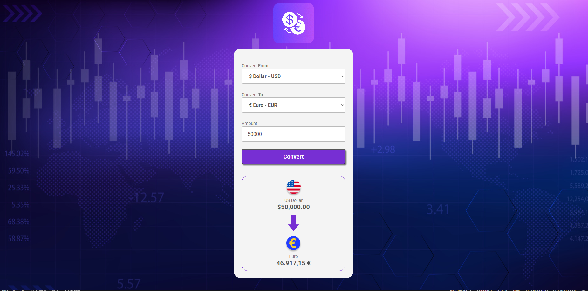

# Project Currency Converter

Introducing the "Currency Converter" web application, crafted using HTML, CSS, and JavaScript. This project empowers users to effortlessly convert between various currencies, including Dollar, Real, Euro, Pound, Bitcoin, and Ethereum. It stands as my initial venture into JavaScript, demonstrating my ability to create a functional currency conversion tool.

## Features

- Currency conversion for Dollar, Real, Euro, Pound, Bitcoin, and Ethereum.
- User-friendly interface for seamless input and output.
- Utilizes static currency values as of 17/09/2023 (not real-time).
- HTML and CSS contribute to the project's structure and styling.

## Technologies Used

- 
- 
- 

## Preview

[Link to Live Demo](https://jhschier.github.io/ProjectCurrencyConvert/)

## About

The "Currency Converter" project reflects my introductory experience with JavaScript and showcases my capacity to design a practical web application for currency conversion. It features a user-friendly interface and employs static values as of 17/09/2023 for accurate conversions.
